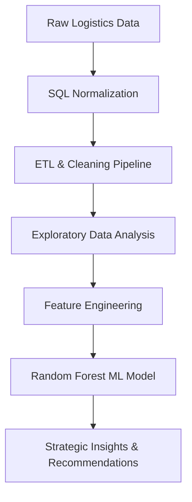

# 🚚 Logistics & Supply Chain: Comprehensive Delay Prediction & Network Optimization

  

  
  
  
  

---

## 📈 Performance Summary

  
  
  

---

## 📊 Comprehensive Visual Analysis (EDA)
This project includes an exhaustive exploratory data analysis covering all aspects of the supply chain network.

### 🔍 1. Data Distribution & Correlation

  
  

  <i>Fig 1 & 2: Correlation Heatmap and Feature Distribution.</i>

### 🚛 2. Shipment & Hub Performance

  
  

  
  

### 🗺️ 3. Regional Delay Bottienecks

  
  

### ⏲️ 4. Temporal Trends & Fleet Efficiency

  
  

  
  

### 🛰️ 5. GPS Provider Reliability

  

  <i>Fig 13: Comparative analysis of GPS downtime across different providers.</i>

---

## 🛠️ Technical Implementation

### 🔄 Data Lifecycle Workflow

### 🧠 Model Architecture (Random Forest)
*   **Preprocessing:** Handled high cardinality in `Origin Hub` and `Vehicle Type`.
*   **Feature Selection:** Prioritized `Distance`, `Planned Travel Time`, and `Vehicle Age`.
*   **Evaluation:** Used Confusion Matrix and ROC-AUC to ensure high precision in predicting delayed status.

---

## 🚀 Strategic Roadmap
1.  **Infrastructural Fix:** Replace underperforming GPS providers identified in the comparative analysis.
2.  **Hub Optimization:** Prioritize resource allocation to high-delay hubs identified in regional analysis.
3.  **Predictive Guard:** Deploy the Random Forest model to flag "At-Risk" shipments before they leave the origin.

---

## 👤 Author
**Mohamed Salah Abdelhamid**
*   LinkedIn: [mohamedsalah-abdelhamid](https://www.linkedin.com/in/mohamedsalah-abdelhamid/)
*   GitHub: [@mohamedsalahabdelhamid](https://github.com/mohamedsalahabdelhamid)

---

  Optimizing Supply Chain Reliability through Predictive Analytics 🚚

