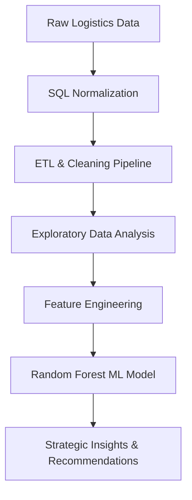

# 🚚 Logistics & Supply Chain: Delay Prediction & Network Optimization

  

  
  
  
  

---

## 📈 Performance Summary

  
  
  

---

## 📄 Project Narrative
This project presents a high-level technical and operational evaluation of a **21-month logistics dataset** (March 2019 – December 2020). By implementing a normalized SQL database and a predictive Random Forest model, this project identifies a data-driven path to reducing delays and optimizing supply chain reliability.

### 🔄 Data Lifecycle Workflow

---

## 🛠️ The Technical Core

<b>1. Database Engineering (SQL)</b>

 
Designed a 4-layer architecture with 7 major foreign key constraints.
<ul>
  <li><b>Reference Layer:</b> Status codes and reference types.</li>
  <li><b>Core Entities:</b> Hubs, Customers, and Products.</li>
  <li><b>Fleet Layer:</b> Staff and Vehicle tracking.</li>
  <li><b>Transactional Layer:</b> Normalized shipment records.</li>
</ul>

<b>2. Machine Learning Pipeline (Python)</b>

 
Built a rigorous 6-stage transformation pipeline.
<ul>
  <li><b>Feature Selection:</b> Correlation analysis to find key delay predictors.</li>
  <li><b>Modeling:</b> Random Forest Classifier for robust prediction.</li>
  <li><b>Validation:</b> Confusion matrix and ROC-AUC for performance tracking.</li>
</ul>

---

## 📊 Visual Insights & Data Discovery

### 🗺️ Network Delay Heatmap
Analysis of "Origin Hub" bottlenecks shows critical delays in specific geographic clusters.

  

### 📈 Temporal Volume vs. Reliability
Correlation matrices uncovering the relationship between GPS providers and delivery status.

  
  

---

## 🚀 Strategic Roadmap
1.  **Infrastructural Fix:** Replace underperforming GPS providers identified in `plot_13`.
2.  **Hub Optimization:** Prioritize resource allocation to high-delay hubs identified in EDA.
3.  **Predictive Guard:** Deploy the Random Forest model to flag "At-Risk" shipments before they leave the origin.

---

## 👤 Author
**Mohamed Salah Abdelhamid**
*   LinkedIn: [mohamedsalah-abdelhamid](https://www.linkedin.com/in/mohamedsalah-abdelhamid/)
*   GitHub: [@mohamedsalahabdelhamid](https://github.com/mohamedsalahabdelhamid)

---

  Transforming Logistics through Data Science & Engineering 🚛

